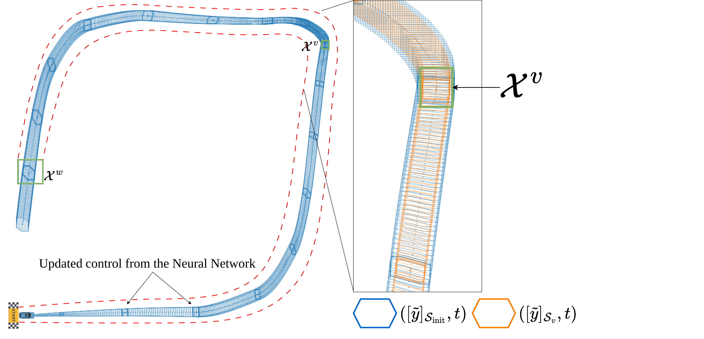
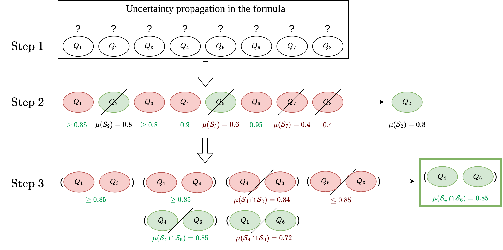
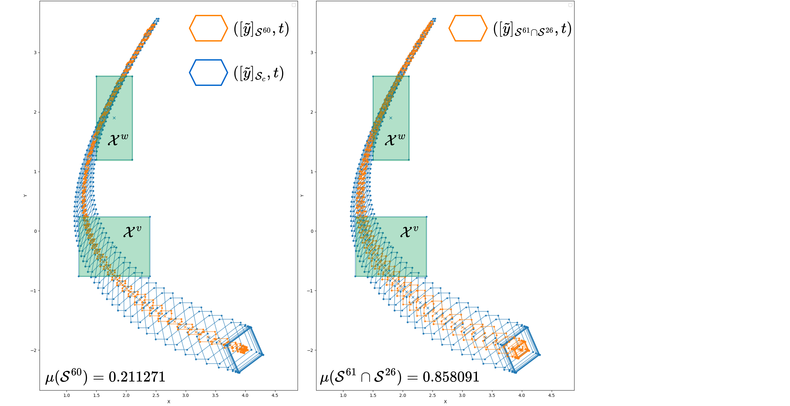

# IJAR-2026-Confidence-STL
Code of submission IJA-D-26-00168 for the International Journal of Approximate Reasoning

# Set-Based Monitoring and Safe Set Computation for a Neural Network Controlled System under STL Specifications

This repository provides a prototype implementation for the verification of Signal Temporal Logic (STL) formulas on reachable tubes of Neural Network Controlled Systems (NNCS), as described in:

> A. Besset, J. Tillet, and J. Alexandre dit Sandretto, *"Set-Based Monitoring for Signal Temporal Logic with Uncertainty Mitigation and Confidence Guarantees,"* International Journal of Approximate Reasoning, 2025.

The tool computes guaranteed probabilistic lower bounds on the satisfaction of STL specifications for a nonlinear vehicle model controlled by a Multilayer Perceptron (MLP), using reachability analysis and the Potential Cloud formalism. It has been tested on Linux Ubuntu only.

---

## 1. Prerequisites and Installation

### 1.1. DynIbex

This software depends on **DynIbex**, a validated numerical integration library built on top of IBEX. Install DynIbex following the instructions at:

> https://perso.ensta-paris.fr/~chapoutot/dynibex/index.php#download-installation

On recent Ubuntu distributions, the build may require a Python 2.7 virtual environment and explicit specification of the C++ standard:

```bash
sudo CXXFLAGS="-std=c++14" ./waf configure
sudo CXXFLAGS="-std=c++14" ./waf install
```

For a local (non-system-wide) installation, export the `PKG_CONFIG_PATH` variable in the Makefile or in your shell:

```bash
export PKG_CONFIG_PATH='<path_to_dynibex>/share/pkgconfig'
```

### 1.1.2. Patching DynIbex Header Files

**Important:** Several header files provided with this distribution must be copied into your DynIbex installation before building. These files contain modifications required for affine arithmetic access, simulation data extraction, and expression handling used by the NNCS verification tool.

Copy the following files into the DynIbex **include directory** (typically `<path_to_dynibex>/include/ibex/` or the corresponding source directories prior to compilation):

| Provided File | Description |
|---|---|
| `ibex_Expr.h` | Extended expression tree with additional node access required for symbolic differentiation and function composition. |
| `ibex_Affine2.h` | Modified affine form class with additional accessors for extracting noise symbol coefficients and center values. |
| `ibex_Affine2_fAFFullI.h` | Extended sparse affine form (full interval variant) with public access to the ray list and garbage interval. |
| `ibex_simulation.h` | Modified simulation class exposing the affine form state at each integration step, enabling zonotope extraction from the validated ODE solver. |
| `ibex_ivp_ode.h` | Extended ODE initial value problem structure with affine-form initial conditions and derivative computation interfaces. |
| `ibex.h` | Updated master include file ensuring all required DynIbex modules are available. |
| `ibex_Setting.h` | Build configuration header specifying the IBEX release version and enabled backends. |

To apply the patch, assuming DynIbex is installed at `<DYNIBEX_DIR>`:

```bash
cp ibex_Expr.h            /include/ibex/
cp ibex_Affine2.h         /include/ibex/
cp ibex_Affine2_fAFFullI.h /include/ibex/
cp ibex_simulation.h      /include/ibex/
cp ibex_ivp_ode.h         /include/ibex/
cp ibex.h                 /include/ibex/
cp ibex_Setting.h         /include/ibex/
```

If you are building DynIbex from source, place these files in the corresponding source directories **before** running the build commands. Failing to apply these modifications will result in compilation errors due to missing accessors on affine forms and simulation objects.

### 1.2. Additional Dependencies

The following libraries are required and must be available on the system:

- **GLPK** (GNU Linear Programming Kit) — used for the linear programming subproblems arising during safe set computation.
- **Qhull** — used for convex hull computations on zonotopic sets.

On Ubuntu, these can typically be installed via:

```bash
sudo apt-get install libglpk-dev libqhull-dev libqhullcpp-dev
```

### 1.3. Building the Project

Open a terminal in the project directory and compile:

```bash
make
```

To build in debug mode with profiling and full warnings:

```bash
make DEBUG=yes
```

This produces the executable `simulation.out`.

---

## 2. Running the Simulation

Execute the compiled binary from the project directory:

```bash
./simulation.out
```

The program performs an iterative safe set identification loop (up to 20 iterations). At each iteration, the following operations are carried out:

1. A reachable tube is computed for the closed-loop NNCS using validated ODE integration and affine arithmetic propagation through the neural network.
2. The STL specification is evaluated over the tube.
3. If satisfaction is uncertain, uncertainty tracking and DNF-based constraint selection identify the optimal scaling vector maximizing the probability of satisfaction.
4. If satisfaction is guaranteed, a robustness overshooting step attempts to enlarge the safe set by identifying the minimum-robustness reachable set.
5. The scaling vector is updated and the process repeats.

Upon successful execution, output of the form below is expected:

```
Launching sim =====>
---------------simulation---------------0
-----end of simudyn-----
...
---------------simulation---------------18
-----end of simudyn-----
Sim finished =====>
===overshoot bound factor ...
0.858091 final 0
printing to file
...
0.952351 final 5
...
0.952351========= max proba =========
```

Reachable set data is written to the `simu_result/` directory.

---

## 3. System Description

### 3.1. Vehicle Dynamics

The vehicle follows a Dubins-like nonlinear model with the following state equations:

$$\dot{y}_1 = \cos(\theta)\, u, \quad \dot{y}_2 = \sin(\theta)\, u, \quad \dot{u} = p_2(u_{\mathrm{ref}} - u), \quad \dot{\theta} = K_c(\theta_{\mathrm{ref}} - \theta) + p_1$$

where $(y_1, y_2)$ denotes the position, $u$ the speed, and $\theta$ the heading angle. The reference commands $(u_{\mathrm{ref}}, \theta_{\mathrm{ref}})$ are provided by the neural network controller. Two uncertain parameters are modeled as stationary Gaussian random variables:

- $\tilde{p}_1 \sim \mathcal{N}(0,\, 0.1^2)$ — fixed steering bias,
- $\tilde{p}_2 \sim \mathcal{N}(2.1,\, 0.06^2)$ — throttle feedback gain.

### 3.2. Neural Network Controller

The MLP controller has the architecture **3 → 20 → 15 → 2** with sigmoid activation functions on hidden layers. It takes as input the current position $(y_1, y_2)$ and time, and outputs the reference commands $(u_{\mathrm{ref}}, \theta_{\mathrm{ref}})$. The controller is updated at 2 Hz (every 0.5 s) over a simulation horizon of 10 s (20 steps).

Weights and biases are stored in `weights.txt` and `biases.txt`, respectively. The activation function for hidden layers can be changed in `DnnAff.cpp` by commenting or uncommenting the relevant function; the same activation must be used in all hidden layers.

### 3.3. STL Specification

The temporal-logic specification verified in this example is:

$$\varphi = G_{[0,\,6.7]}\bigl(v \Rightarrow F_{[3.5,\,4.5]}w\bigr) \;\wedge\; F_{[5.2,\,5.7]}v$$

This formula requires that, globally over the interval $[0, 6.7]$, whenever the vehicle enters predicate region $\mathcal{X}^v$, it must subsequently reach region $\mathcal{X}^w$ within a time window of $[3.5, 4.5]$ seconds; additionally, the vehicle must eventually reach $\mathcal{X}^v$ between $5.2$ and $5.7$ seconds.

The predicate regions are defined in `simulation.cpp` as axis-aligned boxes:

- $\mathcal{X}^v = [1.95,\, 1.99] \times [1.70,\, 1.75]$
- $\mathcal{X}^w = [0.05,\, 0.20] \times [0.85,\, 1.00]$

<p align="center">
  
</p>
<p align="center"><em>Figure 1 — Monte-Carlo sample trajectories (orange) vs. the reachable tube satisfying the STL formula (blue/purple). The blue tube corresponds to the initial parameter set; the orange tube corresponds to the computed safe set. Predicate regions are labeled.</em></p>

---

## 4. Summary of the Approach

### 4.1. Reachability Analysis with Affine Arithmetic

Uncertain quantities are represented as affine forms:

$$x = x_0 + x_1\,\varepsilon_1 + x_2\,\varepsilon_2 + \cdots + x_n\,\varepsilon_n, \quad \varepsilon_i \in [-1, 1],$$

where $x_0$ is the central value and the noise symbols $\varepsilon_i$ are shared across neurons and state variables. This preserves dependencies during propagation through both the neural network and the ODE integration, yielding tighter reachable sets (zonotopes) compared to plain interval arithmetic.

Activation functions (e.g., the sigmoid) are expressed as ODEs ($\mathrm{d}\sigma/\mathrm{d}x = \sigma(x)(1-\sigma(x))$), enabling the use of validated ODE solvers with affine arithmetic to propagate uncertainties through the neural network layers.

The reachable tube is computed using **DynIbex** with a Runge-Kutta 4 scheme and validated error bounds. At each controller update step, the neural network output is evaluated in affine arithmetic, then the continuous dynamics are integrated over the next time step. The resulting tube provides a guaranteed enclosure of all possible system trajectories.

### 4.2. Set-Based STL Evaluation with Uncertainty Tracking

STL formulas are evaluated over the reachable tube using a **three-valued semantics**:

- **1** — guaranteed satisfaction (all enclosed trajectories satisfy the predicate),
- **0** — guaranteed violation (no enclosed trajectory satisfies the predicate),
- **[0, 1]** — undetermined (the reachable set intersects the predicate boundary).

Satisfaction signals are constructed bottom-up from predicates to the root formula using Boolean interval arithmetic. Temporal operators (Until, Finally, Globally) are handled through unitary signal decomposition.

When undetermined satisfaction arises, **uncertainty markers** identify the specific reachable sets responsible. These markers are propagated through the satisfaction tree, enabling targeted refinement.

### 4.3. Safe Set Computation via DNF and Linear Programming

The core objective is to compute a maximal safe parameter set $\mathcal{S}_v$ whose associated reachable tube guarantees satisfaction of the STL formula, thereby maximizing the guaranteed probability lower bound.

<p align="center">
  
</p>
<p align="center"><em>Figure 2 — Computing the DNF of uncertainty markers with probabilistic filtering. Uncertain predicate evaluations are identified (Step 1), individual clause probabilities are computed (Step 2), and clauses are combined into conjunctions ranked by probability (Step 3). The conjunction yielding the highest probability is selected.</em></p>

The procedure operates as follows:

1. **Uncertainty tracking** identifies a reduced set of state-constraint clauses $Q_j$ corresponding to reachable sets that induce undetermined satisfaction.
2. These clauses are organized into a **Disjunctive Normal Form (DNF)** representation of the condition under which the formula is satisfied.
3. For each conjunction of clauses, a **linear programming** problem is solved to find the scaling vector $A$ maximizing the probability $J(A) = \Pr(P \in \mathcal{S}_c^A)$ subject to zonotope inclusion or exclusion constraints with respect to the predicate regions.
4. An aggressive elimination strategy discards conjunctions whose probability cannot exceed the current maximum, significantly reducing the combinatorial cost.

<p align="center">
  
</p>
<p align="center"><em>Figure 3 — Two propagations from different confidence sets. Left: safe set computed using individual-clause under-approximation (probability 0.211). Right: safe set computed using the proposed maximum-probability method (probability 0.858). The blue tube is the initial propagation; the orange tube is the propagation from the computed safe set.</em></p>

### 4.4. Robustness Overshooting for Iterative Refinement

Once satisfaction is guaranteed, a **quantitative robustness metric** identifies the reachable set closest to the satisfaction boundary. The scaling vector is intentionally enlarged to re-enter the uncertainty-tracking regime, allowing the nonlinear uncertainty set $Z_\varepsilon$ to be updated. This iterative process converges toward the tightest safe set achievable under the zonotopic representation.

The robustness metric quantifies the minimum distance from the reachable set to the predicate boundary: positive robustness indicates guaranteed inclusion or exclusion, while zero robustness corresponds to the undetermined case.

### 4.5. Guaranteed Probabilistic Bound

The framework delivers a **guaranteed lower bound** on the probability of STL satisfaction:

$$\Pr\bigl((\hat{y},\, t) \models \varphi\bigr) \geq v,$$

where $v = \Pr(\hat{p} \in \mathcal{S}_v)$ is the probability mass of the computed safe set. For the NNCS example, the approach yields $\Pr((\hat{y},\, t) \models \varphi) \geq 0.834$, compared to a Monte-Carlo estimate of approximately $0.989$ over 500 trials. The gap stems from the inherent conservatism of guaranteed over-approximations.

---

## 5. Code Structure

| File | Description |
|---|---|
| `simulation.cpp` | Main entry point: iterative safe set identification loop. |
| `ZonoSimu.cpp` / `ZonoSimu.h` | System dynamics definition, ODE integration, and closed-loop simulation with NN controller updates. |
| `DnnAff.cpp` / `DnnAff.h` | Affine arithmetic propagation through MLP layers (forward pass with validated activation functions). |
| `ZonoIbex.cpp` / `ZonoIbex.h` | Zonotope representation, operations, scaling vector optimization, and safe set computation via linear programming. |
| `C_STL_adaptative.cpp` / `CSTL.h` | Three-valued STL evaluation: satisfaction signals, temporal operators, uncertainty tracking, DNF construction, and adaptive sampling. |
| `C_STL_robust.cpp` / `CSTL_Robust.h` | Quantitative STL robustness computation on reachable sets and robustness-guided overshooting. |
| `weights.txt` / `biases.txt` | Trained MLP parameters (architecture 3 → 20 → 15 → 2). |
| `dags.dat` | Navigation graph data for the track. |
| `simu_result/` | Output directory for reachable set data. |

---

## 6. STL Formula Verification API

### Supported Operators

```cpp
phi1 = neg_stl(phi);                        // Logical negation: ¬φ
phi1 = and_stl(phi2, phi3);                 // Logical AND: φ₂ ∧ φ₃
phi1 = or_stl(phi2, phi3);                  // Logical OR: φ₂ ∨ φ₃
phi1 = until_stl(phi2, phi3, {t1, t2});     // Until operator: φ₂ U[t1,t2] φ₃
phi1 = Finally(phi, {t1, t2});              // Eventually operator: F[t1,t2] φ
phi1 = Globally(phi, {t1, t2});             // Always operator: G[t1,t2] φ
```

### Predicate Satisfaction

```cpp
predicate_satisfaction(sim, predicates);
```

Constructs satisfaction signals for a list of predicates evaluated over the simulation object. Returns a list of signals, one per predicate.

### Robustness Computation

```cpp
STL_formula_robust(predicate_robust_signals);
```

Computes the quantitative robustness signal for the root formula, propagating robustness values through the satisfaction tree.

### Safe Set Identification

```cpp
get_optimal_scaling_vector(tube, t0, predicates, horizons, param, scaling, conv_limit, uncertainty_trig, init_marker);
get_overshoot_scaling_vector(tube, t0, predicates, param, scaling, conv_limit, init_marker);
```

The first function computes the scaling vector maximizing the probability of satisfaction when the formula evaluation is uncertain. The second function performs robustness-guided overshooting when satisfaction is already guaranteed.

---

## 7. Modifying the Specification

To verify a different STL formula, modify the `STL_formula` function in `C_STL_adaptative.cpp` and, correspondingly, the `STL_formula_robust` function in `C_STL_robust.cpp`. Predicate regions and temporal horizons are defined in `simulation.cpp`.

To change the uncertain parameter distributions, modify the `proba_gen` structures in `simulation.cpp`. Each generator specifies the noise symbol index, mean, and standard deviation.

---

## 8. License

This program is distributed under the terms of the **GNU LGPL**. See the file `COPYING.LESSER`.

## 9. Authors

Antoine Besset, Joris Tillet, and Julien Alexandre dit Sandretto — ENSTA Paris, Institut Polytechnique de Paris.

This research benefited from the support of the STARTS Projects — CIEDS — Institut Polytechnique.

## 10. References
- A. Besset, J. Tillet, J. Alexandre dit Sandretto, *"Uncertainty Removal in Verification of Nonlinear Systems Against Signal Temporal Logic via Incremental Reachability Analysis,"* Proc. 64th IEEE CDC, 2025.
- J. Alexandre dit Sandretto, A. Chapoutot, *"Validated Explicit and Implicit Runge-Kutta Methods,"* Reliable Computing, vol. 22, 2016.
- O. Maler, D. Nickovic, *"Monitoring Temporal Properties of Continuous Signals,"* LNCS vol. 3253, Springer, 2004.
